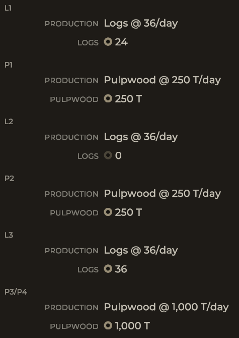

# CargoPerDay

A small Unity Mod Manager mod for Railroader that shows captive cargo production in terms of tons, gallons, and units rather than by car.
This is meant for modded games with modded rolling stock that holds more/less than the vanilla rolling stock.

## How?

This mod patches the `PanelFields` method for the `Industry(Un)loader` classes.
Using a `Postfix`, it then uses `LoadUnits.QuantityString` to replace the `cars` part of `cars/day`.
This is applied to both loading and unloading industries.